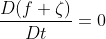
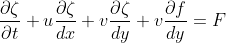
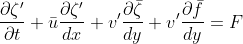
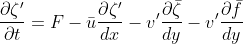

# barotropic_model READ ME

## 1. Introduction
The purpose of this project is to create an atmosphere toy model to solve barotropic vorticity equations. It has several different settings which can be modified, such as using linear or nonlinear dynamics, different forcing scenarios, etc... I only coded out the linear dynamics and made an attempt at nonlinear dynamics and we only coded out topographic forcing but we could have added thermal forcing too. For the topogrpahic forcing you have the option to use 'real' or 'simple' topography, which will be described in more detail in **Section 3**. One main goal of this code is to see how well we can replicate the orographically-forced modeled streamfunction of more complex models. Even the first ever computer circulation model does a pretty amazing job at matching the real meridional mean stream function. Solving for vorticity is key to modelling Rossby waves, which are a key feature of the climate system. 

## 2. Model Dynamics
To spatially solve for vorticity, we're using spherical harmonics through the **windspharm** Python package. One disadvantage of spectral methods is the presence of Gibbs osciallations, which are apparent in the topography field. Then for time integration we're mostly using a forward scheme and switching to a centered scheme every 20 steps, as determined by the variable *forward* in **namelist.py**. To code up the equations we will be solving, first we start out with the absolute vorticity tendancy set to zero:
>  
This equation is then expanded into:
>  
Linearized, this equation is:
>  
Since we want to solve for the vorticity tendancy, we want to set everything to the right side of the equation:
>  

## 3. Code Documentation
### a. Code structure
The main script where we're solving the equations from **Section 2** is **barotropic.py**. This script initializes all the variables we need and the linear dynamics (nonlinear dyamics pending). This script also includes plot and output saving and diagnostics. **forcing.py** is where we set up the topographic forcing. The 'simple' topography (*topography_simple*) is created by a gaussian function. The 'real' topography (*topography_real*) is read in from a file using a function from **xarray_IO.py**. **xarray_OI.py** contains functions fro reading in netCDFs, creating variables and dimenstions for output netCDFs, and eventually writing the netCDF output. The **namelist.py** script should be the only script you should need to edit. The main veriables you should be changing in **namelist.py** are *topo_case* depending out which topography you want to use, the **_freq* variables for how often you want plot and data output. 

(3a) Description of code structure and what different model components do, e.g.: namelist, spectral, netcdf_IO, plotting, barotropic, etc -- good to include a flow diagram of the code), time stepping, I/O interface, etc.
